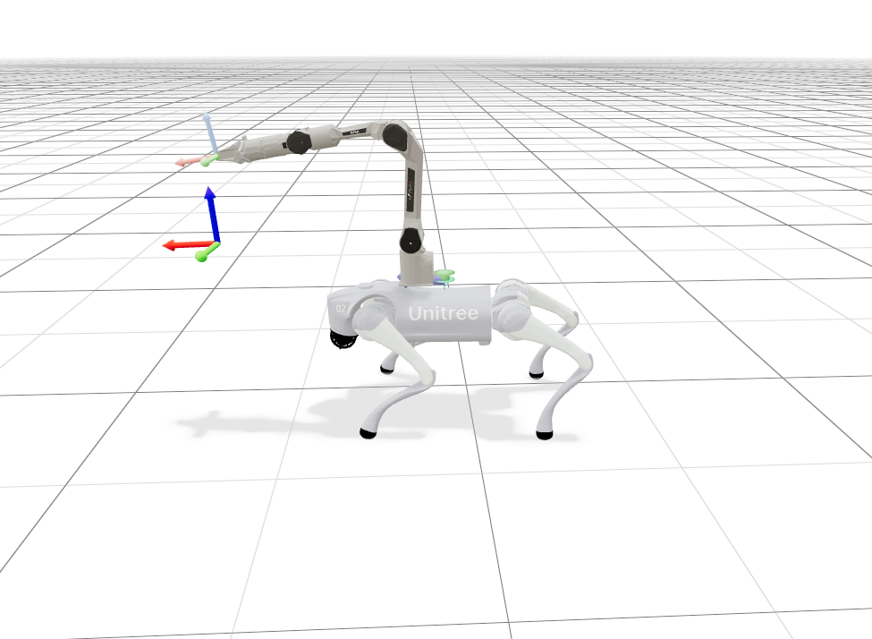

<div align="center">
  <h1>Go2_piper_mjlab</h1>
  
    <p>
      <strong><kbd>中文</kbd></strong>
      <a href="./readme_en.md"><kbd>English</kbd></a>
    </p>
</div>

# 项目描述
本项目是 Unitree Go2 + Agilex Piper 机器人在 mjlab 中的强化学习实现，是 Unitree Go2 系列和 Agilex 机械臂系列的结合。

# 快速开始
## 任务 ID 列表
```bash
Mjlab-Velocity-Flat-Go2arm
Mjlab-Velocity-Rough-Go2arm
```
## 环境配置
配置 uv 环境：
```bash
uv sync
```
## 环境检查
运行环境检查，不采取任何动作：
```bash
uv run play Mjlab-Velocity-Flat-Go2arm \
  --agent zero \
  --viewer viser \
  --num-envs 1
```


运行环境检查，采取随机执行动作：
```bash
uv run play Mjlab-Velocity-Flat-Go2arm \
  --agent random \
  --viewer viser \
  --num-envs 1
```

## 训练
可以使用 wandb 或 tensorboard 进行日志记录，推荐使用 wandb 来实时可视化训练过程。

平坦地形训练：
```bash
uv run train Mjlab-Velocity-Flat-Go2arm \
  --env.scene.num-envs 4096 \
  --agent.logger wandb
```
崎岖地形训练：
```bash
uv run train Mjlab-Velocity-Rough-Go2arm \
  --env.scene.num-envs 4096 \
  --agent.logger wandb
```
恢复训练：
```bash
# 运行时请将 load-checkpoint 参数替换为训练过程中保存的模型文件路径。
uv run train Mjlab-Velocity-Flat-Go2arm \
  --env.scene.num-envs 4096 \
  --agent.resume True \
  --agent.load-run RUN_DIRECTORY_NAME \
  --agent.load-checkpoint model_1000.pt \
  --agent.logger wandb
```
## 播放训练策略
播放策略时，请将 checkpoint-file 参数替换为训练过程中保存的模型文件路径。
```bash
uv run play Mjlab-Velocity-Flat-Go2arm \
  --checkpoint-file /path/to/model.pt \
  --viewer viser \
  --num-envs 1
```


禁用终止条件的仅可视化播放：
```bash
uv run play Mjlab-Velocity-Flat-Go2arm \
  --checkpoint-file /path/to/model.pt \
  --viewer viser \
  --num-envs 1 \
  --no-terminations True
```
## sim2sim
可使用 MuJoCo 完成 sim2sim 验证。运行时需指定 checkpoint 文件路径。目前发现 sim2sim 的效果不理想，后续将会进行改进。

指定任务参数：
```bash
uv run python deploy/simulation/sim2sim.py \
  --checkpoint /path/to/model.pt \
  --lin-vel-x 0.2 \
  --lin-vel-y 0.0 \
  --ang-vel-z 0.0 \
  --ee-x 0.48 \
  --ee-y 0.0 \
  --ee-z 0.36
```
键盘控制：
```bash
uv run python deploy/simulation/sim2sim_keyboard.py \
  --checkpoint /path/to/model.pt
```

# 致谢
该项目建立在 [mjlab](https://github.com/mujocolab/mjlab) 基础框架之上，感谢 mjlab 的作者和贡献者们将此项目开源提供给广大开发者使用。

机器狗 + 机械臂强化学习参考了 [Go2Arm_Lab](https://github.com/zzzJie-Robot/Go2Arm_Lab) 和 [Go2_ARX_mjlab](https://github.com/Czy213hd/Go2_ARX_mjlab)。

# 许可证

本仓库基于 mjlab，并保留原始 Apache-2.0 许可证。详情请参见 LICENSE。

第三方资产和代码保留其原始许可证。特别是在商业项目或重新分发项目中使用前，请检查 Go2 和 Piper 资产随附的许可证文件。

如果你在研究中使用底层 mjlab 框架，也请引用原始 mjlab 项目。
